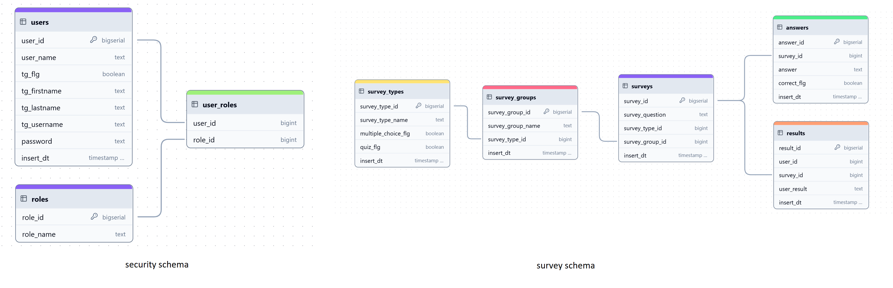

# multi-survey-bot
Приложение для создания опросов.

Телеграм-бот используется для прохождения опросов пользователями.

### Настройка параметров и запуск приложения
- В файле docker-compose.yml указаны настройки для поднятия контейнера с базой Postgres. Необходимо запустить контейнер.
- Таблицы для работы приложения будут созданны в базе согласно описанию в src/main/resources/db_changelog.xml.
- В файле настроек src/main/resources/application.yml необходимо указать название заранее зарегистрированного телеграм-бота telegram-bot.name и токен для него telegram-bot.token.
- В том же файле application.yml указать свой ключ spring.jpa.security.jwt.private-key, который используется для обеспечения безопасности при аутентификации и авторизации в приложении.

### Схема БД

### Swagger
http://localhost:8081/swagger-ui/index.html
